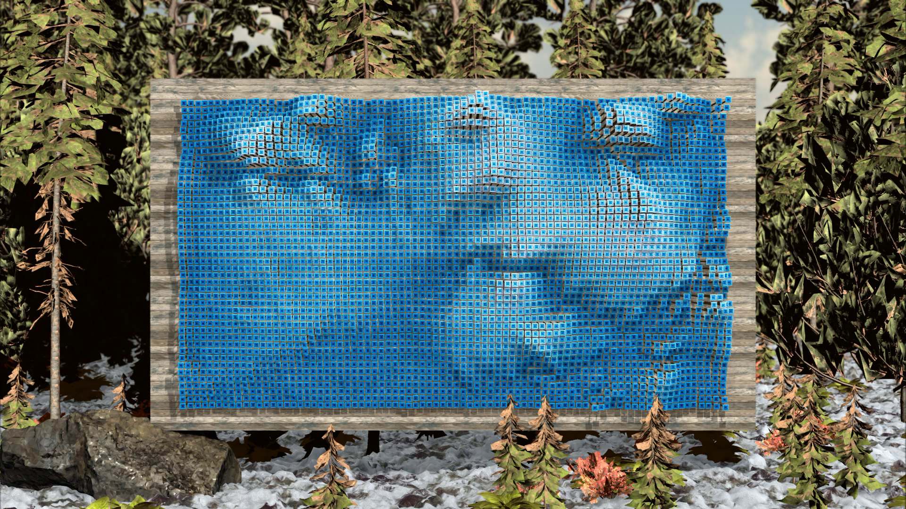
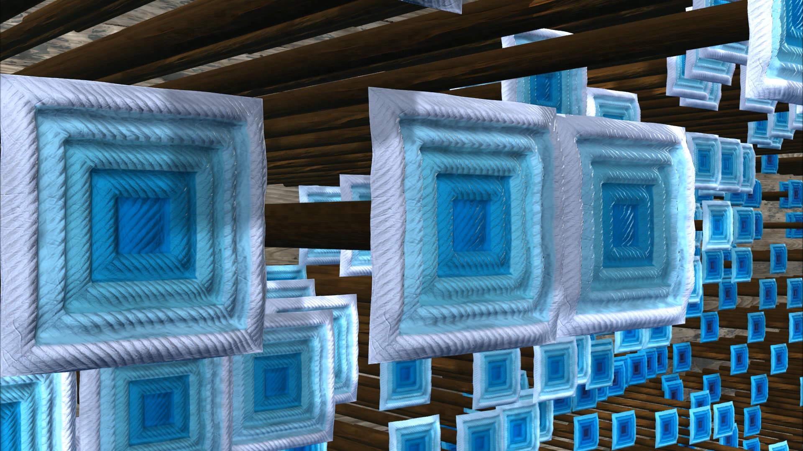
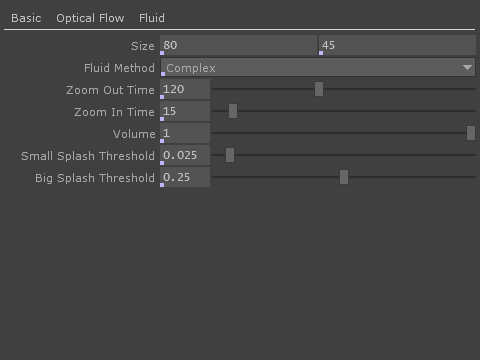
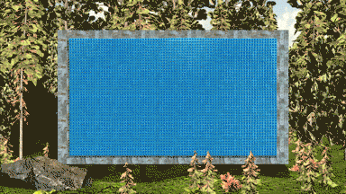

# [Pool](https://vimeo.com/292219596)

### Notes:
Most PBR/substance textures are 2048x2048 resolution. Would scaling this down increase the fps? And at what cost to the render quality?

Should the "Environment" GEO be added to the shadow casters in the Light COMP?

Complex Fluid never goes completely flat. Maybe there should be an idle timer, so after a while the velocity diffusion goes down to zero, flattens the fluid and then goes back up to the default value.

Currently the movement only comes from the red channel (movement in the x-axis), but there's also green channel information (y-axis). Should that be included?

Audio right now is various .wav files of splashes. Better would be physically based model fluid simulation sounds.

