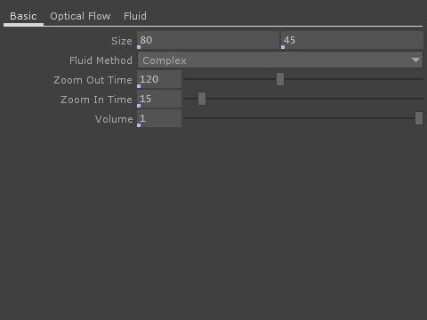

# [Pool](https://vimeo.com/292219596)

### Notes:
   Keep in mind texture sizes. Mandala textures are currently 1024x1024, most others are 2048x2048. Would increasing them give better looking renders, or is the texture size already excessive and killing the fps. Does it even matter?

   Should the "Environment" GEO be added to the shadow casters in the Light COMP?
